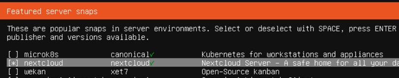
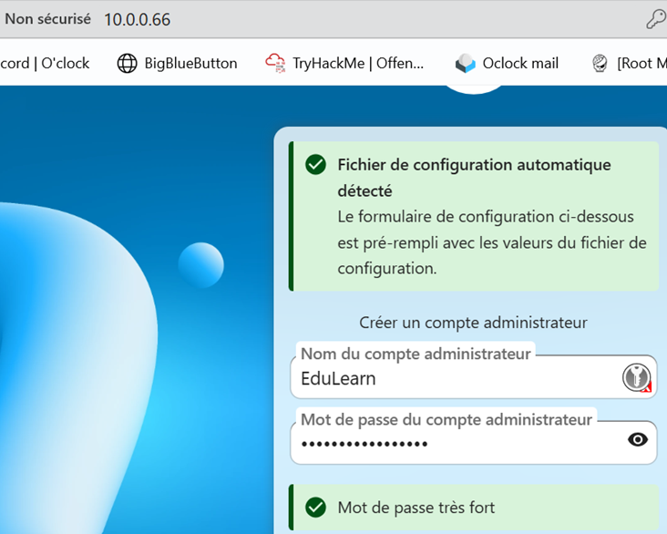
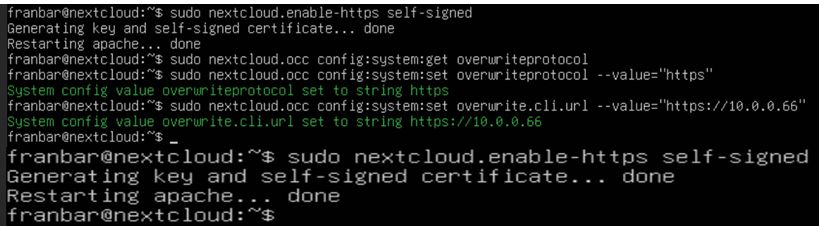
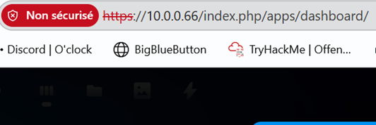
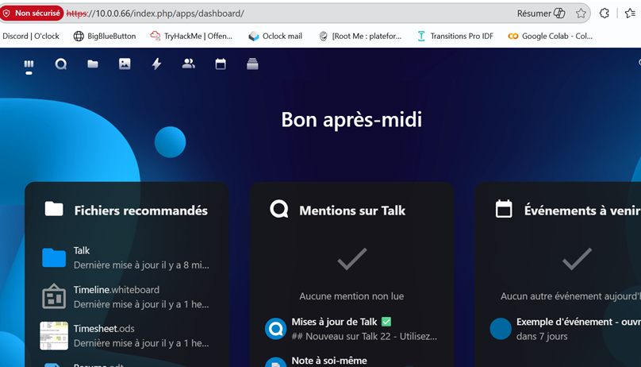

# Atelier C203 – Nextcloud: Déploiement pour une startup EdTech

---

> 👉 [**Instructions**](https://github.com/O-clock-Aldebaran/SC2E03-nextcloud-FrancoisBarsotti-Oclock) 

📚 **Ressources complémentaires**

---

## 🎯 Contexte et pitch de l'atelier

> Déployer une solution Nextcloud complète pour remplacer les outils actuels :
>1.	Stockage et partage de fichiers (remplace Dropbox)
>2.	Suite bureautique collaborative (remplace Google Docs)
>3.	Chat et visioconférence (remplace WhatsApp + Zoom)
>4.	Calendriers et tâches partagés
>5.	Gestion d'équipe (15 utilisateurs, 5 groupes)
>
>**Contraintes** :
>* Infrastructure : VM Ubuntu sur Proxmox
>* 15 utilisateurs à créer
>* Organisation complète à structurer

## Environnement
**À créer** :
* VM Ubuntu 24.04 LTS
* RAM : 8 GB minimum
* CPU : 4 vCPU
* Disque : 80–100 GB
* Réseau : accès Internet

## Architecture cible

```

┌────────────────────────────────────┐
│   VM Ubuntu 24.04                  │
│   RAM: 8 GB | CPU: 4 vCPU          │
│                                    │
│  ┌──────────────────────────────┐  │
│  │   Nextcloud Hub              │  │
│  │                              │  │
│  │  • Files (Stockage)          │  │
│  │  • Talk (Chat + Visio)       │  │
│  │  • Calendar & Tasks          │  │
│  │  • OnlyOffice (Bureautique)  │  │
│  │  • Deck (Kanban)             │  │
│  └──────────────────────────────┘  │
└────────────────────────────────────┘

**Organisation** :
• 15 utilisateurs
• 5 groupes métiers
• Structure de dossiers partagés
```

# Mission

### Installation

#### Ubuntu sur Proxmox


* Lors de l'installation d'Ubuntu 24.04, on peut installer **nextcloud** :



* Une fois installé, on peut accéder à nextcloud avec l'IPv4 de la VM en http:



* Pour sécuriser le site sans avoir à acheter le domaine, on peut rajouter un `certificat auto-signé` en CLI : 



Et ainsi on pourra se reconnecter en `https` auto-signé: 



* Une fois la connexion admin fonctionnelle en https, on peut activer les services requis (directement sur le site de nextcloud):

    * Stockage et partage de fichiers (File access control + Team Folders)
    * Chat et visioconférence (Talk)
    * Suite bureautique collaborative (Nextcloud Office : édition .docx, .xlsx, .pptx)
    * Calendrier et contacts
    * Gestion de tâches (Deck: pour Kanban)




