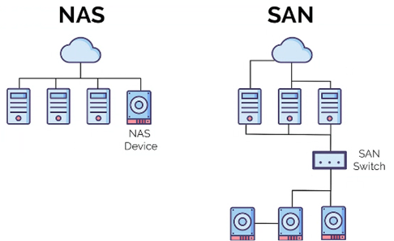

# 🌐 Session B101. La Virtualisation.

## Qu'est-ce que la virtualisation ?

La virtualisation est une technologie qui permet de créer des versions virtuelles de ressources informatiques, telles que des serveurs, des postes de travail, des systèmes d'exploitation et des
applications, sur un matériel physique unique.

En d'autres termes, la virtualisation permet de faire fonctionner plusieurs systèmes d'exploitation ou applications sur un seul serveur physique, comme si chacun d'eux disposait de son propre matériel dédié.


### Historique de la virtualisation
Ça a commencé en 1960 !

La virtualisation a ses racines dans les années 1960 avec l'émergence des systèmes d'exploitation (OS) capables d'exécuter plusieurs programmes simultanément.

Les systèmes de partage de temps ont permis à plusieurs utilisateurs de partager les ressources d'un ordinateur central, ouvrant la voie à la virtualisation.

Au début des années 1970, la virtualisation a pris son essor avec des systèmes comme IBM VM/370, qui permettaient à plusieurs systèmes d'exploitation de s'exécuter sur un seul ordinateur physique.

La virtualisation a ensuite connu une évolution significative avec l'arrivée des processeurs x86 et l'essor des systèmes d'exploitation tels que Linux et Windows.

* Les années 1990 ont vu l'émergence de solutions de virtualisation commerciales comme VMware Workstation et [Microsoft Virtual PC]( Microsoft Virtual PC from 2003 - Unboxing & Exploring!!).
* Au début des années 2000, les solutions de virtualisation ont connu une popularité croissante, grâce à l'essor des serveurs physiques et à la nécessite d'optimiser les ressources informatiques.
* L'arrivée du cloud computing a donné un nouvel élan à la virtualisation, permettant aux entreprises de déployer des services informatiques flexibles et évolutifs.

## Principes de la virtualisation

La virtualisation repose sur le concept de création d'une abstraction d'un système physique, ce qui permet à un seul système physique de supporter plusieurs systèmes d'exploitation et applications virtuelles.

_**Un hyperviseur**_, également connu sous le nom de moniteur de machine virtuelle, est le logiciel qui gère cette abstraction.

Il permet d'isoler les systèmes d'exploitation et les applications virtuelles les uns des autres, tout en fournissant un accès sécurisé aux ressources physiques.


L'hyperviseur fonctionne comme un intermédiaire entre le matériel physique et les systèmes d'exploitation virtuels. Il gère l'allocation des ressources, telles que la mémoire, le processeur et le stockage, entre les systèmes virtuels.

De plus, il gère la communication entre les systèmes virtuels et le matériel physique, assurant un environnement sécurisé et isolé pour chaque système virtuel.

Il existe **deux types** d'hyperviseurs.

### Hyperviseurs de type 1
Également appelés hyperviseurs "**Bare-Metal**", ils s'exécutent directement sur le matériel informatique, offrant des performances supérieures et une meilleure sécurité. Il fait impression d’être installé sur la machine hôte, mais on passera via un navigateur. Il sera installé sur un serveur.

Ils sont généralement utilisés dans les **environnements de production**.

### Hyperviseurs de type 2
Ces hyperviseurs fonctionnent en tant qu'applications sur un système d'exploitation hôte, simulant le matériel pour les machines virtuelles.

Ils sont souvent utilisés pour la virtualisation de postes de travail, les tests et le développement.

c'est la première couche logicielle qui tourne sur le matériel. Si tu as un OS avant de lancer l'hyperviseur, c'est un type 2 (sauf Hyper-V) car Hyper-V est intégré à Windows.


## Hyperviseurs populaires
### VMware vSphere
Une plateforme de virtualisation puissante offrant une gestion centralisée, le provisionnement automatisé de machines virtuelles et des fonctionnalités avancées telles que la haute disponibilité et la reprise après sinistre.

❗ **Hyperviseur de type 1**.


### Microsoft Hyper-V

Intégré aux systèmes d'exploitation Windows Server, Hyper-V est une solution de virtualisation native offrant une intégration étroite avec les autres produits Microsoft et des performances optimales sur les plateformes Windows.

❗ **Hyperviseur de type 1**.


### Oracle VM VirtualBox

Un hyperviseur open source populaire, connu pour sa compatibilité avec de nombreux systèmes d'exploitation et sa simplicité d'utilisation. Il est souvent utilisé pour le développement, les tests et les déploiements de bureau.

❗ **Hyperviseur de type 2**.


### Citrix XenServer

Une solution de virtualisation de serveurs axée sur la performance et l'évolutivité, proposant des fonctionnalités avancées de gestion, de sécurité et de haute disponibilité, prisée dans les environnements exigeants.

❗ **Hyperviseur de type 1**.


### Proxmox VE
Une plateforme de virtualisation open source basée sur le noyau Linux (sur Debian), offrant une gestion centralisée des machines virtuelles et des conteneurs, avec une interface conviviale et une grande flexibilité pour les entreprises de toutes tailles.

‼️ **Hyperviseur de type 1 ET 2**

**La base Debian** : Proxmox est basé sur une distribution Linux complète (Debian). Pour un observateur, cela ressemble à un système d'exploitation classique sur lequel on aurait ajouté une couche logicielle, ce qui rappelle le Type 2.

**La double technologie** : Proxmox gère deux types de virtualisation :
* **Les VMs (via KVM)** : Virtualisation complète (Type 1).
* **Les Conteneurs (via LXC)** : Virtualisation au niveau du système d'exploitation. Bien que ce ne soit pas du "Type 2" au sens strict, cette polyvalence pousse certains auteurs à le présenter comme une solution hybride. Cette double technologie fait la force de ProxMox.


### Définition :

La virtualisation crée une couche d'abstraction qui permet aux systèmes d'exploitation et aux applications de s'exécuter dans un environnement virtuel, **sans nécessairement exiger le matériel physique** sous-jacent.

Cela permet aux organisations de mieux utiliser leurs ressources matérielles, d'améliorer l'efficacité et de **réduire les coûts d'exploitation**.

## 🔝 Avantages de la virtualisation

### Réduction des coûts

La virtualisation permet de réduire les couts matériels en consolidant plusieurs serveurs physiques sur un seul serveur physique. Cela permet également de réduire les coûts d'électricité, de refroidissement et de maintenance.

### Amélioration de la flexibilité et de la rapidité

La virtualisation permet de créer et de déployer des machines virtuelles rapidement et facilement, ce qui permet de répondre aux besoins changeants de l'entreprise. Elle permet également de provisionner facilement des ressources supplémentaires pour faire face à une demande accrue.

### Sécurité

La virtualisation permet de renforcer la sécurité en isolant les machines virtuelles les unes des autres, ce qui limite l'impact des attaques malveillantes. Elle permet également de mettre en œuvre des politiques de sécurité plus strictes.

### Disponibilité accrue

La virtualisation permet de mettre en œuvre des solutions de haute disponibilité, ce qui garantit la continuité des services en cas de panne de matériel.

Elle permet également de réaliser des mises à jour et des restaurations rapidement et facilement.

## ❗ Inconvénients de la virtualisation

### Complexité

La virtualisation peut introduire une complexité supplémentaire dans l'environnement informatique. La gestion et la maintenance des machines virtuelles et des hyperviseurs peuvent exiger des compétences spécialisées et des outils spécifiques. Il faut également prendre en compte les problèmes de compatibilité et d'interopérabilité entre les différents composants logiciels.

### Performances

Bien que la virtualisation permette une utilisation plus efficace des ressources matérielles, elle peut également introduire une surcharge, ce qui peut affecter les performances des systèmes virtuels. Il est donc essentiel de bien dimensionner les ressources et de surveiller les performances pour éviter les dégradations.

### Coûts de licence

Certaines solutions de virtualisation nécessitent l'achat de licences, ce qui peut augmenter les coûts. Il est important de bien évaluer les besoins et de comparer les différentes solutions disponibles pour choisir celle qui offre le meilleur rapport qualité-prix.

### Sécurité

Bien que la virtualisation offre des avantages en matière de sécurité, elle peut également introduire de nouveaux risques, notamment en ce qui concerne la gestion des accès et la protection des données entre les machines virtuelles. Il est donc crucial de mettre en place
des mesures de sécurité appropriées pour protéger l'environnement virtualisé.

## Types de virtualisation 📝

La virtualisation englobe plusieurs types, chacun répondant à des besoins spécifiques en matière de gestion des ressources informatiques.

### Virtualisation du serveur 📥

La virtualisation du serveur permet de créer plusieurs systèmes d'exploitation virtuels sur un serveur physique unique. Cela optimise l'utilisation des ressources matérielles et réduit les coûts.

### Virtualisation du poste de travail 💻

Cette technique permet de créer un environnement de bureau virtuel accessible depuis n'importe quel appareil, améliorant ainsi la flexibilité et la mobilité des utilisateurs.

### Virtualisation des applications 🐋

La virtualisation des applications consiste à empaqueter une application et toutes ses dépendances dans une image virtuelle, facilitant ainsi son déploiement sur différentes plateformes.

### Virtualisation du stockage 💾

Cette méthode crée un pool de stockage virtuel partagé par plusieurs serveurs, simplifiant la gestion et améliorant l'efficacité de l'utilisation du stockage.

### Virtualisation du réseau 🌐

La virtualisation du réseau permet de créer des réseaux virtuels gérés de manière centralisée, facilitant la configuration et offrant une meilleure isolation des flux de données (pfsense et configuration du vmbr sur proxmox).

## Virtualisation du serveur 📥

La virtualisation des serveurs offre plusieurs avantages clés :

### Consolidation du matériel

Elle permet de regrouper plusieurs systèmes d'exploitation et applications sur un seul serveur physique, optimisant ainsi l'utilisation du matériel et réduisant les couts d'énergie et de maintenance.

### Flexibilité et évolutivité

Les serveurs virtualisés offrent une grande flexibilité en termes d'allocation des ressources, permettant de les ajuster facilement en fonction des besoins des applications.

### Réduction de l'empreinte carbone

En diminuant le nombre de serveurs physiques nécessaires, la virtualisation contribue à réduire la consommation d'énergie et les émissions de CO2, aidant ainsi les entreprises à atteindre leurs objectifs environnementaux.

## Virtualisation du poste de travail 💻

La virtualisation des postes de travail (VDI) consiste à exécuter un système d'exploitation et ses applications sur un serveur distant, permettant aux utilisateurs d'accéder à leur environnement de travail depuis n'importe quel appareil (genre RDS ou Citrix).


## Virtualisation des applications 🐋

La virtualisation des applications permet de séparer une application de son environnement physique, facilitant ainsi son exécution sur différentes machines virtuelles, indépendamment du système d'exploitation ou de l'architecture matérielle.

Les conteneurs offrent un niveau d'abstraction plus élevé que les machines virtuelles traditionnelles, encapsulant une application et ses dépendances dans un environnement isolé pour une exécution cohérente sur diverses plateformes.


## Virtualisation du stockage 💾

Virtualisation du stockage
La virtualisation du stockage permet de créer des pools de stockage virtuels partagés entre plusieurs serveurs, simplifiant ainsi la gestion et améliorant l'efficacité de l'utilisation des ressources de stockage.

### Stockage en réseau (SAN)

Le **SAN** (_Storage Area Network_) connecte les serveurs à des dispositifs de stockage via un réseau dédié, **offrant une infrastructure de stockage** centralisée et flexible. Il permet une gestion centralisée des ressources de stockage et une meilleure isolation des flux de données, ce qui facilite la gestion des données.

On l'utilise principalement pour la virtualisation des serveurs et des applications, car ils peuvent partager des ressources de stockage.

### Stockage en réseau attaché (NAS)

Le **NAS** (_Network Attached Storage_) fournit un accès aux données aux serveurs via le réseau local, **permettant un partage de fichiers simplifié** et une gestion centralisée du stockage.

La différence entre le **SAN** et le **NAS** est que le **SAN** est connecté à une infrastructure de stockage centralisée, tandis que le NAS est connecté directement aux serveurs et aux utilisateurs.

]()

## Virtualisation du réseau 🌐

Virtualisation des réseaux
La virtualisation des réseaux, également appelée SDN (Software-Defined Networking), consiste à créer des réseaux virtuels sur une infrastructure physique existante. Cela permet de séparer le plan de contrôle du plan de données, offrant une flexibilité accrue et une gestion simplifiée.

Sur LinkedIn on trouve une définition intéressante de [la virtualisation du réseau](https://www.linkedin.com/pulse/cest-quoi-la-virtualisation-des-r%C3%A9seaux-academy-zegus/)

### 🔝 Avantages de la virtualisation des réseaux

### Avantages de la virtualisation des réseaux

* **Flexibilité accrue** : Permet de créer, configurer et gérer des réseaux virtuels de manière programmatique, facilitant l'adaptation aux besoins changeants.

* **Gestion centralisée** : Offre une vue unifiée pour l'administration des ressources réseau, simplifiant les opérations.

* **Isolation des applications** : Assure une séparation efficace entre différentes applications, améliorant la sécurité et la performance.

* **Automatisation des tâches** : Facilite l'automatisation des configurations et des déploiements, réduisant les erreurs humaines.

### Déploiement rapide des services

La virtualisation des réseaux permet de déployer des applications et des services plus rapidement grâce à des fonctionnalités telles que la duplication et la réplication des réseaux virtuels. Cela réduit le temps de mise sur le marché et améliore l'efficacité opérationnelle.

### Réduction des coûts

En optimisant l'utilisation des ressources et en évitant l'investissement dans du matériel dédié pour chaque réseau, la virtualisation des réseaux contribue à une diminution significative des dépenses liées à l'infrastructure physique.

## Conclusion 📝

La virtualisation est une technologie puissante qui offre de nombreux avantages, notamment en termes de réduction des coûts, de flexibilité, de sécurité et de disponibilité.

Cependant, elle présente également des défis, tels que la complexité de la gestion, les performances, les coûts de licence et les considérations de sécurité.

Il est donc essentiel d'évaluer soigneusement les besoins de l'entreprise et de planifier la mise en œuvre de la virtualisation de manière appropriée pour maximiser les bénéfices tout en minimisant les risques.

## ## VMware Workstation & ProxMox VE

## VMware Workstation 
### Qu'est-ce que c'est ?
VMware Workstation est un **hyperviseur de type 2** : un logiciel de virtualisation qui s'installe sur un système d'exploitation existant (Windows, Linux).

### Architecture

```nginx
┌─────────────────────────────────┐
│   VM 1    │ VM 2      │ VM 3    │ ← Machines virtuelles
├─────────────────────────────────┤
│       VMware Workstation        │ ← Hyperviseur
├─────────────────────────────────┤
│       Windows / Linux           │ ← OS hôte
├─────────────────────────────────┤
│       Matériel physique         │ ← Votre PC
└─────────────────────────────────┘
```

C'est l'équivalent **professionnel** de VirtualBox, avec des fonctionnalités avancées.

### Fonctionnalités principales de VMware Workstation

### Gestion de VM
* Interface graphique intuitive
* Support de nombreux OS invités
* Configuration simple des ressources

### Snapshots
Sauvegarde de l'état complet d'une VM à un instant T

* ✅ Retour en arrière possible
* ✅ Tests sans risque
* ✅ Multiples points de restauration

### Clonage
Duplication rapide de machines virtuelles

* **Clone complet** : VM indépendante
* **Clone lié** : économie d'espace disque (VM copié, mais le stockage non). Si le stockage est compromis sur une VM, les autres auront le même souci.

### Réseaux virtuels
Plusieurs modes disponibles :

* **NAT** : Partage la connexion de l'hôte
* **Bridge** : VM comme un vrai PC sur le réseau
* **Host-Only** : Réseau isole hôte – VM
* **Custom** : Réseaux personnalisés

### Intégration VMware

* Connexion à des serveurs ESXi distants
* Gestion de vCenter (avec licence Pro)
* Import/export OVF/OVA (standard industriel)

### Fonctionnalités pratiques de VMware

* ✅ Partage de dossiers hôte ~ VM
* ✅ Copier-coller entre hôte et VM
* ✅ Unity Mode (intégration applications) : permet de "sortir" les applications d'une machine virtuelle pour les afficher directement sur votre bureau principal, comme si elles étaient installées sur votre propre ordinateur.
* ✅Support USB avance

## 🔝 Avantages VMware

### Pour la formation

* ✔️ Interface professionnelle
* ✔️ Standard de l'industrie IT
* ✔️ Documentation riche
* ✔️ Passerelle vers ESXi/vSphere

### Pour les tests

* ✔️ Environnements isolés et sécurisés
* ✔️ Snapshots = expérimentation sans risque
* ✔️ Multiples OS sans multiplier le matériel

### Performance et stabilité

* ✔️ Optimisations avancées
* ✔️ Support matériel récent
* ✔️ Virtualisation imbriquée bien supportée

## Cas d’usage VMware

### 🎓 Formation et certification

* Préparation CCNA, MCSA, RHCSA ...
* Labs de test sans matériel physique
* Simulation d'infrastructures réseau

### 💻 Développement et tests

* Tester applications sur différents OS
* Environnements de dev isolés
* Tests de compatibilité multi-plateformes

### 🔒 Sécurité et analyse

* Analyser malwares en environnement isolé
* Tester configurations de sécurité
* Forensic et reverse engineering

Exemple de [site pour faire des analyses des VM]( https://app.any.run/) prêtes à être cassées, avec les analyses 

### 🔧 Administration système

* Tester mises à jour avant production
* Former équipes sur nouveaux outils
* Documenter procédures avec VM de référence

## Proxmox VE

### Qu'est-ce que c'est ?

Proxmox Virtual Environnent est un **hyperviseur de type 1** : il s'installe **directement sur le matériel**, sans OS intermédiaire.

Plateforme **open-source** de virtualisation et conteneurisation.

### Architecture

```nginx
┌─────────────────────────────────┐
│   VM 1    │   Container │  VM 2 │ ← VM et conteneurs
├─────────────────────────────────┤
│           Proxmox VE            │ ← Hyperviseur
├─────────────────────────────────┤
│       Matériel physique         │ ← Serveur dédié
└─────────────────────────────────┘
```

Basé sur **Debian** (distribution Linux stable)

### Proxmox VE

**Double technologie**

Proxmox combine deux technologies de virtualisation :

### KVM (Kernel-based Virtual Machine)

**Virtualisation complète**

* ✅ N'importe quel OS (Windows, Linux, BSD ... )
* ✅ Chaque VM a son propre kernel
* ✅ Isolation totale entre VM

### LXC (Linux Containers)

**Conteneurisation légère**

* ✅ Partage du kernel avec l'hôte
* ✅ Uniquement pour Linux
* ✅ Démarrage ultra-rapide (quelques secondes)
* ✅ Consommation minimale de ressources

## Fonctionnalités principales de Proxmox

### Interface web complète

* ✅ Accessible via navigateur (port 8006)
* ✅ Gestion centralisée : VM, conteneurs, stockage, réseau
* ✅ Console intégrée (VNC/SPICE)
* ✅ Monitoring temps réel

### Gestion du stockage

Support de multiples types :
* ✅ Disques locaux (LVM, ZFS, Directory)
* ✅ Stockage réseau (NFS, iSCSI, Ceph)
* ✅ Cloud storage (S3 ... )

### Gestion réseau avancée

* ✅ VLANs
* ✅ Bridges (ponts réseau)
* ✅ Bonds (agrégation de liens)
* ✅ Firewall intégré

### Backups et restauration

* ✅ Backups automatisés (scheduler)
* ✅ Snapshots avant backup
* ✅ Compression et déduplication
* ✅ Restauration rapide

### Haute disponibilité

Avec clustering multi-nœuds :
* ✅ Réplication de VM
* ✅ Migration automatique en cas de panne
* ✅ Gestion du quorum

## 🔝 Avantages de ProxMox

### Open-source et gratuit

* Code source ouvert (licence AGPL)
* Version community complète et gratuite, c’est qui est payant c’est le support
* Pas de limitations artificielles
* Mises à jour régulières

### Tout-en-un

* VM complètes (KVM) + Conteneurs (LXC)
* Interface web unique pour tout
* Pas besoin d'outils externes

### Simplicité

* Installation rapide (10-15 min)
* Interface intuitive
* Pas besoin d'être expert Linux

### Performance

* Accès direct au matériel (type 1)
* Overhead minimal
* Support des technologies récentes

### Écosystème Linux

* Basé sur Debian (stable et fiable)
* Compatible outils Linux standards
* Communauté active et réactive


